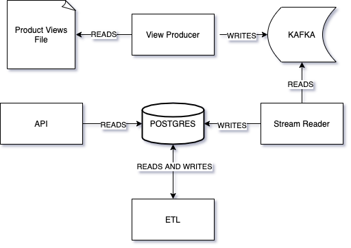

= Hepsi Recommendation Demo Application
:doctype: book
:icons: font
:source-highlighter: highlightjs
:toc: left
:toclevels: 4
:sectlinks:

== * * *Please note that `Hepsi Recommendation` is currently deployed to the cloud in the form of a `Docker Swarm` cluster.*

You can list individual components of the cluster in the <<components, Components>> section.

== Summary

This is a demo project implemented for `*Hepsiburada*` interview rounds of *2020*. This is a just simple betting coupon sales application implemented only for demonstation purposes.

The application generates `ready-made` recommendations to the user, based on best-selling product categories and the interest of the user. Users can also query for and manage their browsing history of products in the system.

== Motivation

This application is implemented to unite batch and real-time data pipelines over a high-performance `Rest API`, all of which constitute a real-time recommendation engine.

== Code style

This project uses https://en.wikipedia.org/wiki/Model%E2%80%93view%E2%80%93controller[`Model-View-Controller`] pattern for the directory structure and resposibility distribution among layers of abstraction.

We deliberately chose not to employ https://en.wikipedia.org/wiki/Entity-control-boundary[`Entity-Control-Boundary`] pattern for practicality.

image:https://img.shields.io/badge/code%20style-standard-brightgreen.svg?style=flat[js-standard-style]

== Tech/framework used

Project was built with the following technologies:

- https://www.oracle.com/java/technologies/javase-jdk11-downloads.html[Java 11]
- https://spring.io/projects/spring-boot[Spring-Boot]
- https://spring.io/projects/spring-batch[Spring-Batch]
- https://www.postgresql.org/[PostgreSQL]
- https://www.liquibase.org/[Liquibase]
- https://kafka.apache.org/[Kafka]
- https://maven.apache.org/[Maven]
- https://www.docker.com/[Docker]

Please make sure that you have your local environment set up properly before installation and use.

== Installation

To build and run the application, you need to separately run the following commands at the root directory of the project:

 mvn install

 docker-compose up -d

After that, run the following command to check and see the docker containers running in the background.

  docker ps

== Basic Flow

On startup, the application begins population history and recommendation tables with data coming from users' product view events and ETL batch processes. Afterwards, these data can be aggregated via the `Rest API`

== Components[[components]]

This application comprises of *five* main components:

. `hepsi-recommendation-api`
. `hepsi-recommendation-database`
. `hepsi-recommendation-etl`
. `hepsi-recommendation-stream-reader`
. `hepsi-recommendation-view-producer`

Below diagram depicts the flow between components:

=== Extra Features

. *Swagger UI*[[swagger-ui]]
* http://159.203.76.146:9598/swagger-ui.html[`hepsi-recommendation-api`]

== Testing

You can always interact with the `Rest API` resources of the application through <<swagger-ui, `*Swagger UI*`>>

You can also check link:hepsi-recommendation-api/src/test/java/com/hepsiburada/api[this folder] for unit tests.

